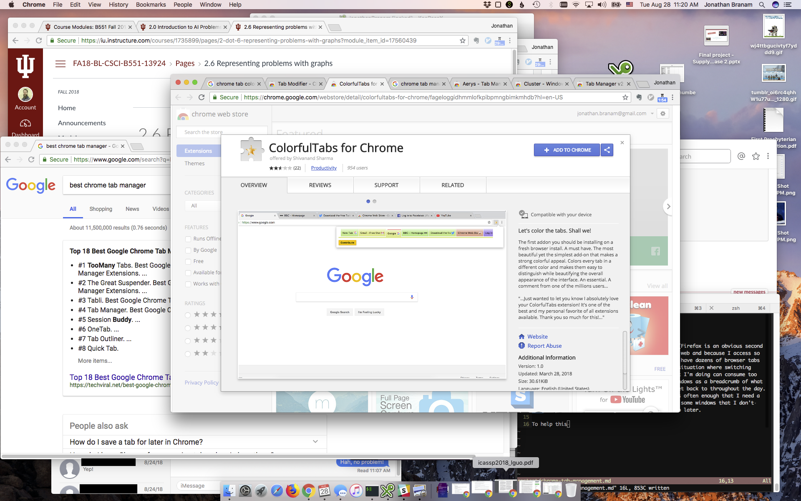

Title: Chrome Tab Management
Date: 2018-08-28 11:15
Category: Tools
Tags: tools, resources, chrome

I prefer Google Chrome for everything I do online (Firefox is an obvious second
choice). Because so much information is now on the web and because I access so
many applications through my browser, I can easily have dozens of browser tabs
and windows open at the same time. This creates a situation where switching
between the windows and tabs to find and track what I'm doing can consume too
much of my time. I often use a trail of browser windows as a breadcrumb of what
I have been working on and things that I need to get back to throughout the day.
This isn't a good management method, but it happens often enough that I need a
better solution to manage it. I generally minimize some windows that I don't 
currently need but that I might want to get back to later.

My screen often looks like this, or worse:

{ width=600 }

To help this situation I am trying to find a way to color the Chrome tabs and/or
to use a tab manager to help organize my work. But I can't find a colorizer!

Tab managers:

 * [Cluster](https://chrome.google.com/webstore/detail/cluster-window-tab-manage/aadahadfdmiibmdhfmpbeeebejmjnkef?hl=en)

